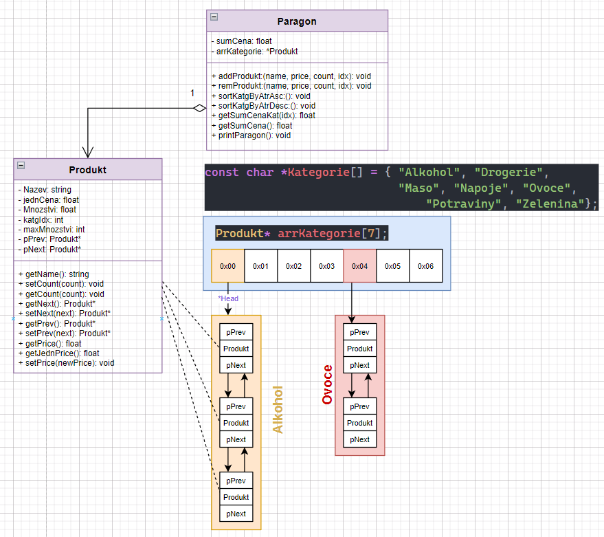

<h1>Vysoká škola polytechnická Jihlava 

<h3>Team: T22_sp</h3> 

#### Autorský team:
- Jiří Bukovský, bukovs05@student.vspj.cz
- Jiří Kalina, kalina08@student.vspj.cz
- Jiří Karmasin, karmasin@student.vspj.cz
- Michal Makovec, makovec@student.vspj.cz

### Formulace zadání
Cílem zadání je sestavení konzolové aplikace pro práci s nákupním lístkem tzv. paragonem. Hlavní funkcionalita má být uspořádávání položek podle kategorie, Dále pak vkládání a odebírání položek a kontrola nákupu povoleného množství. 

V našem případě se bude jednat o nákupní paragon supermarketu s potravinami. U každé položky nákupního lístku je předem známa její kategorie a počet kategorií je taktéž předem známy a neměnný.

Kategorie:
- Alkohol
- Drogerie
- Maso
- Nápoje
- Ovoce
- Potraviny
- Zelenina
> Celkem 7 kategorií produktů

### Návrh zvoleného řešení 
Hlavní uspořádání v nákupním paragonu bude tedy po kategoriích. Vzhledem k tomu, že kategorie budou neměnné, volíme za tímto účelem datovou strukturu pole ukazatelů o velikosti sedmi prvků. Každá položka pole bude ukazatelem na datovou strukturu obousměrný spojový seznam, který bude sloužit jako datová struktura pro uchování nákupních položek v jednotlivých kategoriích.

#### Schéma řešení

Třída `nParagon` obsahuje pole sedmi ukazatelů v předem stanoveném stanoveném pořadí definovaném obchodním domem takto:
> __Index:Kategorie__=[0:Alkohol, 1:Drogerie, 2:Maso, 3:Nápoje, 4:Ovoce, 5:Potraviny, 6:Zelenina]
> 
Každý jednotlivý ukazatelem je `*head` ukazatelem spojového seznamu pro jednotlivé kategorie. Třída si eviduje celkovou sumu ceny všech přidaných položek na nákupní paragon a dále pak sumu ceny v jednotlivých kategoriích. Třída má metody pro přidání a odebrání produktu. Dále pak metody pro řazení sestupně a vzestupně dle ceny nebo názvu v jednotlivých kategoriích.

Třída `Produkt` je každá jednotlivá položka, jež může být přidána na nákupní paragon prostřednictvím metody `addProdukt` nebo odebrána `remProdukt`. Položka je `Produkt` je vždy přidána na konec spojového seznamu v příslušné kategorii

### Logická interpretace
### Fyzická interpretace
### Odůvodnění volby datové struktury a navrhovaných algoritmů
Pro celkové řešení byla zvolena kombinace dvou datových struktur. V případě kategorií bylo zvoleno pole s předem definovanou velikostí. Víme, že kategorie produktů se neboudou často měnit a tím docílíme konstantního přístupu ke kategoriím.  

Pro jednotlivé produkty jsme zvolili obousměrný spojový seznam. Ten se jeví jako nejefektivnější struktura pro ukládání produktů. V našem případě totiž nevíme kolik produktů a jaké kategorie bude jednotlivý nákupní paragon obsahovat.  

Spojový seznam nám tedy umožní přidávat do každé kategorie libovolné množství produktů, aniž bychom museli předem definovat jeho velikost. Vkládání produktu bude vždy na konec seznamu. Volíme obousměrný spojový seznam, protože předpokládáme časté odebírání produktů a teké implementaci řadících algorytmů. Obousměrný spojový seznam je praktičtějčí pro výše uvedené operace. Obousměrný seznam sice zabere více paměti ale v připadě nákupního paragonu, kde se většinou jedná o desítky položek, je to zanedbatelné.
### Vyjádření složitosti
### Diskuze nad složitostí, výhodami a nevýhodami zvolených postupů